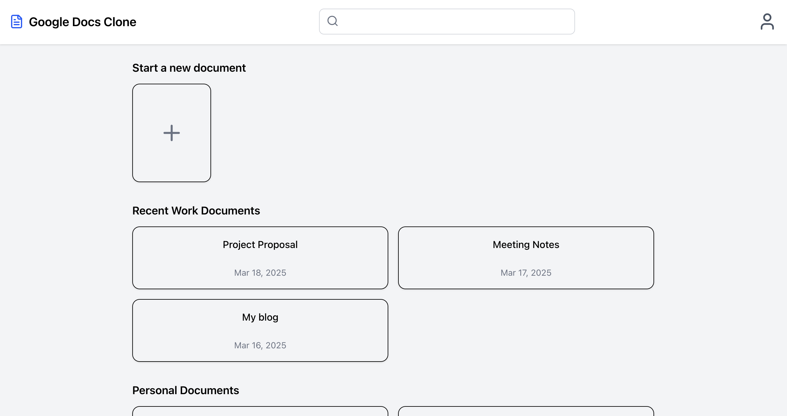
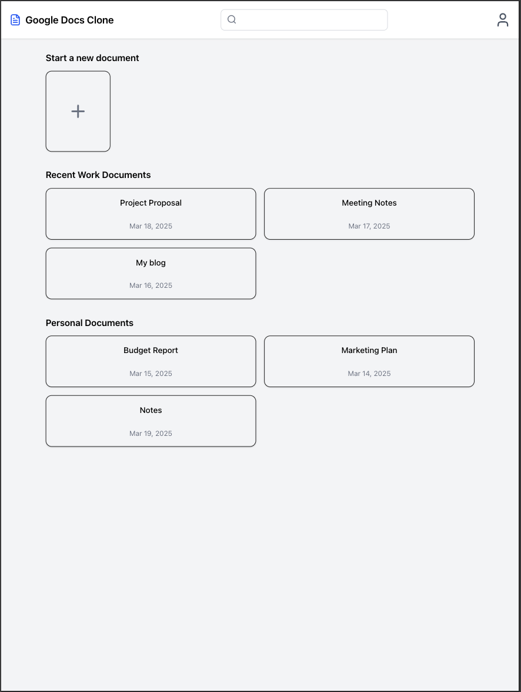
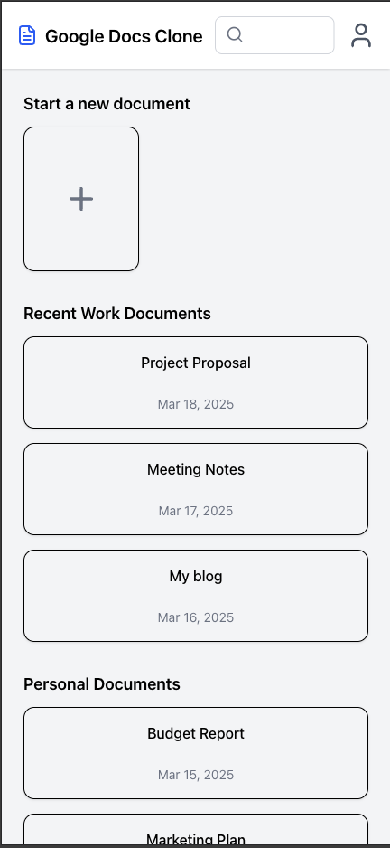

# Google Docs Clon

## 1. Introduction
Front-end Google Docs Clone with React. js/Next. js styled with Tailwind CSS. X HTML, which would yield a clean reusable component-based structure, as well as a responsive layout across desktop, tablet, and mobile views. Navbar with search bar, a section to create new documents and a reusable section displaying recent documents.

---

## 2. Component Structure

To improve maintainability and scalability, the project follows a modular component structure:

* **components/Navbar.tsx:** Holds the top nav bar with logo, search bar and user profile.

* **components/RecentDocuments.tsx:** A reusable component to render recent documents.

* **pages/index.tsx** — It is the homepage, which imports and renders all components.
---

## 3. Responsive Design Implementation

✅ **Breakpoints**

We use Tailwind CSS breakpoints to make the design adapt to different screen sizes:

DeskTop - The layout on desktop looks full with search bar and several document lists



Tablet – A more compact layout with a reduced search bar.



Mobile – Stacked layout & A search bar optimized for small screens.



✅ **Tailwind Utility Classes Flexibility**

We use:

`grid grid-cols-1 md:grid-cols-2` for responsive column layout.

`w-1/3` for search bar that adjusts itself with screen w.

`flex justify-between items-center ` to keep the spacing.

---

## 4. Data Source for Reusable Components

The RecentDocuments component takes a documents prop, which allows dynamic data injection.

Example data used:

```
const documents1 = [
  { id: 1, title: "Project Proposal", date: "Mar 18, 2025" },
  { id: 2, title: "Meeting Notes", date: "Mar 17, 2025" },
];

```
This makes the component reusable multiple times with different data sources.

---

## Conclusion:

I successfully implemented a **Google Docs Clone** using **React.js/Next.js** while making sure that it is **reusabilty** and **responsiveness**. By structuring components efficicntly and leveling Tailwind CSS, I created a clean and adaptable UI that works accross different screen sizes. This project helped me imprive my understanding of component-based architecture and responsive design.